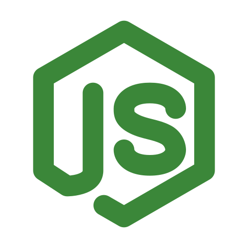

<h1 align="center">Back-End_node</h1>

Repositório que contém a parte básica do meu aprendizado em Back-End.

<a href="https://www.flaticon.com/free-icon/nodejs_15380914?term=nodejs&page=1&position=3&origin=tag&related_id=15380914">
    

        
    

</a>

    
    

#

### Sobre
Aqui você encontrará um modelo introdutório para uma compreenção mais simples de back-end utilizando JavaScript com Node.js

Já que se trata de uma versão básica, não implementei banco de dados, arquivos HTML.

Ele funciona da seguinte maneira
- #### Armazena
    - ele armazena informações de um filme (id, titulo_original, titulo_br, diretor e ano);

- #### Exibe
    - ele exibe os filmes cadastrados;

- #### Busca
    - ele busca o filme de acordo com seu id

- #### Deleta
    - ele deleta o filme com base no id
#

### Como Usar
Para utilizar primeiramente é necessário fazer o clone do repositório

logo após o clone, pelo terminal, instale o express.

        npm install --dev-save express

agora é só rodar a aplicação, para isso digite no terminal.

        npm run dev

Para testar suas funcionalidades, você precisa de um software para testar a API, enviar requisições HTTP e visualizar as respostas.

...Agora, é só testar.

#

### Diretórios e Arquivos
O modelo básico constitui em:

- #### back-end_node
    - Pasta geral que armazena todos os diretórios (controladores, rotas), arquivos (package, index.js)...

- #### controladores
    - Esse diretório armazena os "controladores" (ou "controllers"). 
    
    - Eles são responsáveis por lidar com a lógica do aplicativo. Quando uma rota é acessada, o controlador decide o que deve acontecer.
    
    - ex: interagir com o banco de dados, processar dados recebidos ou preparar uma resposta.

- #### rotas
    - Esse diretório contém as "rotas" do aplicativo. As rotas definem os caminhos específicos que os usuários podem acessar na aplicação. 
    
    - Cada rota está associada a uma função em um controlador que vai executar alguma ação.

- #### index.js
    - Este arquivo é o ponto de entrada do aplicativo. Ele configura e inicia o servidor, definindo como as rotas e os controladores devem ser usados.

- #### package.json
    - Esse arquivo contém informações sobre o projeto e as dependências (bibliotecas externas que o projeto usa). 
    
    - Ele também pode incluir scripts para rodar comandos no projeto, como iniciar o servidor.
#
